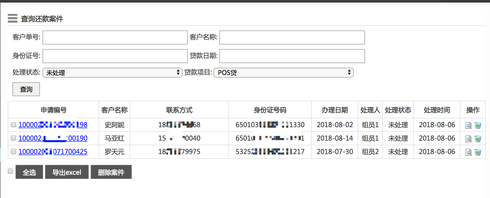
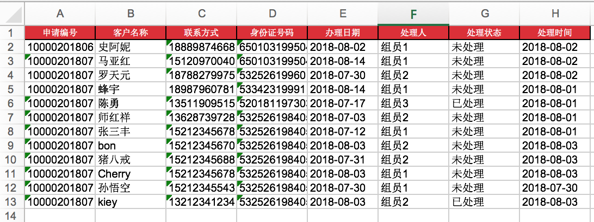

#### 最近做项目要使用到导出Excel的表格. 正好Django有`xlwt`这个库.

今天给大家分享一下如何使用这个库的.

因为django不自带.需要我们自己安装这个库

```python
pip install xlwt
```

安装好只有我们就可以开始写我们的代码了.

案例:我们以导出客户贷款信息的模块为列来讲解xlwt的使用.

首先在自己的视图函数中导入模块,需要使用到如下的两个模块

```
# 1.导出excel的库
import xlwt
# 2.实现了在内存中读写bytes
from io import BytesIO
```

>###### BytesIO
>
>StringIO操作的只能是str，如果要操作二进制数据，就需要使用BytesIO。
>
>BytesIO实现了在内存中读写bytes，我们创建一个BytesIO，然后写入一些bytes：
>
>```
>>>> from io import BytesIO
>>>> f = BytesIO()
>>>> f.write('中文'.encode('utf-8'))
>6
>>>> print(f.getvalue())
>b'\xe4\xb8\xad\xe6\x96\x87'
>```
>
>请注意，写入的不是str，而是经过UTF-8编码的bytes。
>
>和StringIO类似，可以用一个bytes初始化BytesIO，然后，像读文件一样读取：
>
>```
>>>> from io import BytesIO
>>>> f = BytesIO(b'\xe4\xb8\xad\xe6\x96\x87')
>>>> f.read()
>b'\xe4\xb8\xad\xe6\x96\x87'
>```
>
>###### 小结
>
>StringIO和BytesIO是在内存中操作str和bytes的方法，使得和读写文件具有一致的接口。

我们定义导出函数`export_excel`

```python
# 导出excel数据
def export_excel(request):
    # 设置HTTPResponse的类型
    response = HttpResponse(content_type='application/vnd.ms-excel')
    response['Content-Disposition'] = 'attachment;filename=order.xls'
    # 创建一个文件对象
    wb = xlwt.Workbook(encoding='utf8')
    # 创建一个sheet对象
    sheet = wb.add_sheet('order-sheet')
    
	# 设置文件头的样式,这个不是必须的可以根据自己的需求进行更改
    style_heading = xlwt.easyxf("""
            font:
                name Arial,
                colour_index white,
                bold on,
                height 0xA0;
            align:
                wrap off,
                vert center,
                horiz center;
            pattern:
                pattern solid,
                fore-colour 0x19;
            borders:
                left THIN,
                right THIN,
                top THIN,
                bottom THIN;
            """)
    
    # 写入文件标题
    sheet.write(0,0,'申请编号',style_heading)
    sheet.write(0,1,'客户名称',style_heading)
    sheet.write(0,2,'联系方式',style_heading)
    sheet.write(0,3,'身份证号码',style_heading)
    sheet.write(0,4,'办理日期',style_heading)
    sheet.write(0,5,'处理人',style_heading)
    sheet.write(0,6,'处理状态',style_heading)
    sheet.write(0,7,'处理时间',style_heading)

    # 写入数据
    data_row = 1
    # UserTable.objects.all()这个是查询条件,可以根据自己的实际需求做调整.
    for i in UserTable.objects.all():
     	# 格式化datetime
        pri_time = i.pri_date.strftime('%Y-%m-%d')
        oper_time = i.operating_time.strftime('%Y-%m-%d')
        sheet.write(data_row,0,i.loan_id)
        sheet.write(data_row,1,i.name)
        sheet.write(data_row,2,i.user_phone)
        sheet.write(data_row,3,i.user_card)
        sheet.write(data_row,4,pri_time)
        sheet.write(data_row,5,i.emp.emp_name)
        sheet.write(data_row,6,i.statu.statu_name)
        sheet.write(data_row,7,oper_time)
        data_row = data_row + 1

    # 写出到IO
    output = BytesIO()
    wb.save(output)
    # 重新定位到开始
    output.seek(0)
    response.write(output.getvalue())
    return response
```

##### 补充一下我们的model

```python
class UserTable(models.Model):
    user_id = models.AutoField(primary_key=True)
    payment = models.ForeignKey(PaymentTable, models.DO_NOTHING, blank=True, null=True)
    name = models.CharField(max_length=256)
    loa_loan = models.ForeignKey(LoantypeTable, models.DO_NOTHING, blank=True, null=True)
    statu = models.ForeignKey(StatuTable, models.DO_NOTHING, blank=True, null=True)
    user_card = models.CharField(max_length=256, blank=True, null=True)
    loan_id = models.CharField(max_length=256, blank=True, null=True)
    user_phone = models.CharField(max_length=256, blank=True, null=True) 
    principal = models.CharField(max_length=256, blank=True, null=True)  # 逾期金额
    pri_date = models.DateField(blank=True, null=True) # 贷款日期
    emp = models.ForeignKey(EmpTable, models.DO_NOTHING, blank=True, null=True) # 贷款处理人
    wallet = models.CharField(max_length=256, blank=True, null=True) 
    operating_time = models.DateField(auto_now=True)  # 贷款处理时间

    def to_dict(self):
        return {
            'user_id' : self.user_id,
            'loan_id' : self.loan_id,
            'name' : self.name,
            'phone' : self.user_phone,
            'card' : self.user_card,
            'date' : self.pri_date.strftime('%Y-%m-%d'),
            'deal_peo' : self.emp.emp_name,
            'status' : self.statu.statu_name,
            'deal_time' : datetime.datetime.now().strftime('%Y-%m-%d')
        }

    class Meta:
        managed = False
        db_table = 'user_table'
```

##### 调取后台函数

前端的操作.重要的就一句话 (可以使用ajax或者a标签的herf属性)去掉用我们的后台视图函数

```html
 <a href="/admin/export_excel/"><button  type="button" class="btnStyle" >导出excel</button></a>
```

前端的效果



最后实现导出的效果.标题是加红色了的,就是上面我们设置的样式.



本文原创出品.欢迎收藏转载!!!!

>**作 者:** lizhonglin
>
>**github:** <https://github.com/Leezhonglin/>
>
>**blog:** <https://leezhonglin.github.io/>


