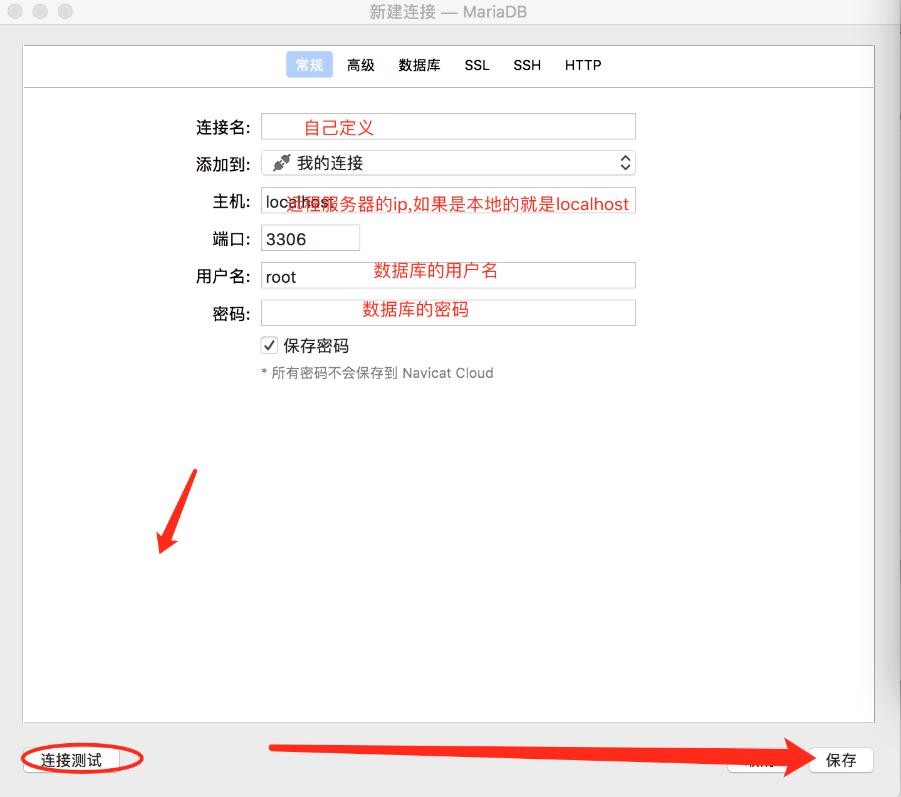
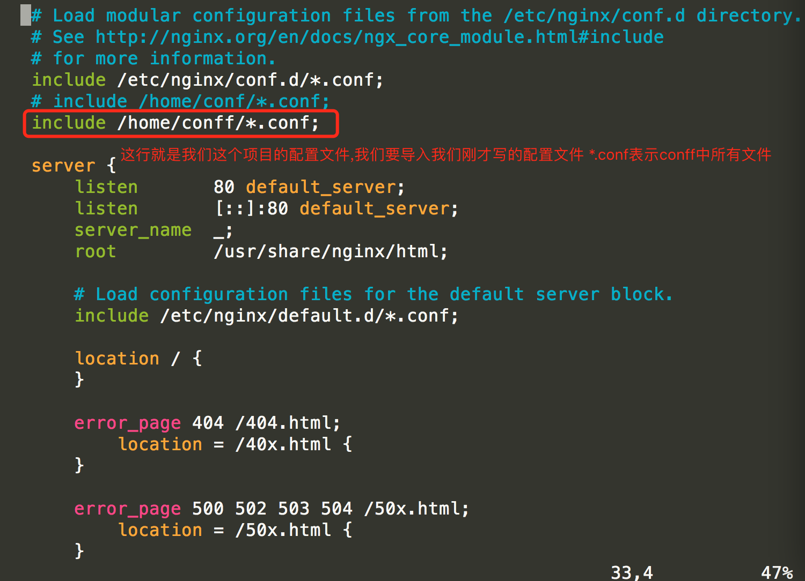
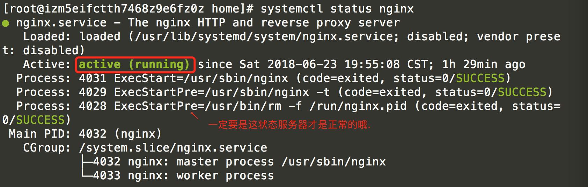
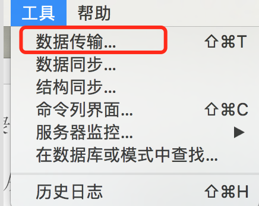

#### Flask项目部署

##### 项目生产环境Flask + mariadb + uwsgi + nginx

```
1. 服务器系统

Centos7.4

2.数据库

mariadb   redis 

3. 程序运行环境

python3.x 
```

由于Centos系统中自带的python版本是的2.x版本的.没有python3. 所以说需要我自己进行安装.

介绍了这么多就开始我们安装我们需要的软件和环境.

###### 1. 安装python3

首先需要安装python3的依赖包,可以复制下面的两行命令进行安装

```
yum -y groupinstall "Development tools"

yum -y install zlib-devel bzip2-devel openssl-devel ncurses-devel sqlite-devel readline-devel tk-devel gdbm-devel db4-devel libpcap-devel xz-devel
```

安装好相关的依赖包之后要根据我们自己的项目需求选择对应的python3的版本,我这里使用的是python3.6.5的版本

```
使用wget命令下载我们的python3

wget https://www.python.org/ftp/python/3.6.5/Python-3.6.5.tar.xz
```

我是是用的root账户登录的系统,所以默认的下载文件的地址是在[/root的目录].这样我们是用命令进入root目录找到我们python3.6.5程序使用xz命令进行文件的解压

```
# 解压文件

xz -d Python-3.6.5.tar.xz

# 解归档

tar -xvf Python-3.6.5.tar
```

切换至Python源代码目录并执行下面的命令进行配置和安装。

```
# 切换到源代码目录

cd Python-3.6.5

# 配置

./configure --prefix=/usr/local/python36 --enable-optimizations

# 编译和安装

make && make install
```

执行上面的三条命令,然后我们就要经历10-20分钟左右的等待(取决于机器的配置).执行完成后会看到Complete! 这样就表示我们的python3.6.5已经安装好.  但是有一个问题是到这里我们的python3.6.5还是不能运行的.我们需要做最后一步操作.建立软件了到系统的环境变量中去.

```
# 建立python3的软连接

ln -s /usr/local/python36/bin/python3 /usr/bin/python3

# 建立pip3的软件链接

ln -s /usr/local/python36/bin/pip3 /usr/bin/pip3
```

执行了这两步操作我们的python3就可以正常的在Centos系统中正常运行了.

###### 2. 安装Mariadb数据库

安装命令. 同时安装mariadb的数据库和客户端程序

```
yum -y install mariadb mariadb-server
```

安装完成后我们要启动mariadb数据库[有如下常用的命令]

```
# 启动数据库

systemctl start mariadb

# 重启数据库

systemctl restart mariadb

# 停止数据库

systemctl stop mariadb

# 查看数据库的运行状态

systemctl status mariadb

# 设置数据库开机自动启动

systemctl enable mariadb
```

启动好数据库后.由于我们是首次使用数据库我们需要配置数据库的初始密码

设置密码的命令是:

```
mysql_secure_installation
```

这样就会进入到如下的页面,按照要求进行设置.

```
Enter current password for root:<–初次运行直接回车

设置密码

Set root password? [Y/n] <– 是否设置root用户密码，输入y并回车或直接回车

New password: <– 设置root用户的密码
Re-enter new password: <– 再输入一次你设置的密码

其他配置

Remove anonymous users? [Y/n] <– 是否删除匿名用户，回车

Disallow root login remotely? [Y/n] <–是否禁止root远程登录,回车,

Remove test database and access to it? [Y/n] <– 是否删除test数据库，回车

Reload privilege tables now? [Y/n] <– 是否重新加载权限表，回车
```

初始化MariaDB完成，接下来测试登录的命令:

```
mysql -u root -p
```

会提示我们数据密码,这个时候我们输入刚才设置的密码就可以登录到数据库中了.

因为项目需要远程连接数据库,数据库默认是没有开启的所以我们需要开启远程连接.在mysql数据库中的user表中可以看到默认是只能本地连接的，所有可以添加一个新的用户，该用户可以远程访问

1. 创建用户

   ```
   # 先使用数据库

   use mysql;

   # 针对ip
   create user 'root'@'192.168.10.10' identified by 'password';

   #全部
    create user 'root'@'%' identified by 'password';  [本项目选择的这条命令,password要替换成自己需要设置的root密码]
   ```

2. 授权

   ```
   # 给用户最大权限  [本项目选择这条命令,password要替换成自己需要设置的root密码]
   grant all privileges on *.* to 'root'@'%' identified by 'password';

   # 给部分权限(test 数据库)

   grant all privileges on test.* to 'root'@'%' identified by 'password' with grant option;

   # 刷新权限表
   flush privileges;

   # 查看
   show grants for 'root'@'localhost';
   ```

   接下来就可以在远程的数据库可视化工具中直接访问该服务器中的mysql了。

   本项目用的是Nacicat

   

   ​

###### 3. 安装项目需要使用的虚拟环境

1. 安装virtualenv

   ```
   yum install python-virtualenv
   ```

2. 创建虚拟环境

   ```
   virtualenv --no-site-packages ajenv

   cd ajenv

   # 激活虚拟环境
   source bin/activate
   ```

3. 安装环境需要的包

   项目文件夹下面自己建立了有一个requirement文件夹下面有一个re_install的文件.就是本项目需要用到的包.这样我们一次性就能全部安装好.

   ```
   pip3 install -r re_install.txt

   其中re_install.txt文件中记录的是需要安装包的名称以及对应的版本
   ```

   ​

##### 部署

前面三个准备工作做好了这样我们就可以放心的做我们部署工作了.

###### 1. 安装nginx服务器

1. 添加nginx存储库

   ```
   yum install epel-release
   ```

2. 安装nginx

   ```
   yum install nginx
   ```

3. 运行启动nginx

   ```
   systemctl start nginx
   ```

   常用的nginx运行命令

   ```
   #查看nginx的状态
   systemctl status nginx 
   # 启动
   systemctl start nginx
   # 停止关闭
   systemctl stop nginx
   # 设置开机启动
   systemctl enable nginx
   # 禁止开机启动
   systemctl disable nginx
   ```

   需要检查一下如果您正在运行防火墙，请运行以下命令以允许HTTP和HTTPS通信：

   ```
   sudo firewall-cmd --permanent --zone=public --add-service=http 

   sudo firewall-cmd --permanent --zone=public --add-service=https

   sudo firewall-cmd --reloa
   ```

   这些都弄好了我们就可以输入服务器的ip地址到浏览器中看到如下界面:


###### 2. 安装uwsgi

1. 安装uwsgi  (因为我们是python3的环境所以我们一定要使用pip3来安装,否则就安装到python2中去了.)

   ```
   pip3 install uwsgi
   ```

2. 将uwsgi配置到环境变量中,建立软链接

   ```
   ln -s /usr/local/python36/bin/uwsgi /usr/bin/uwsgi
   ```

###### 3. 配置项目代码,配置项目nginx.配置uwsgi.ini等

本案例的配置文件，都习惯将每一个项目的配置文件，日志文件，虚拟环境放在一起，这样开发方便，运维也方便维护.项目的目录结构如下：

```
[root@izm5eifctth7468z9e6fz0z home]#

conff  envf  logf  srcf
```

由于我的系统中配置过其他项目.这个项目我重新命名了如上面的四个文件夹.其中：

conff是配置文件，用于存放项目的nginx.conf文件，uwsgi.ini文件

logf是日志文件，用于存放nginx的启动成功和失败文件，以及uwsgi的运行日志文件

envf是用于存放虚拟环境

srcf是项目文件，该目录下上传的是目录代码

###### 4. 配置nginx.conf文件

首先进入conff文件夹中创建一个名称为ajnginx.conf 的文件.

每一个项目对应有一个自己定义的nginx的配置文件，比如爱家项目，我定义为ajnginx.conf文件.具体配置内容如下:

```
server {
    listen       80;
    server_name 47.104.205.141 localhost;

    access_log /home/logf/access.log;
    error_log /home/logf/error.log;

    location / {
        include uwsgi_params;
        uwsgi_pass 127.0.0.1:8890;

        uwsgi_param UWSGI_CHDIR /home/srcf/Aj;
        uwsgi_param UWSGI_SCRIPT manage:app;
    }
}
```

>说明: 
>
>listen — 表示监听的端口
>
>server_name — 表示服务名称(有域名可以换成域名)
>
>access_log   — nginx成功的文件日志地址
>
>error_log   — nginx失败了的错误日志文件地址
>
>location — 接收请求
>
>include uwsgi_params — 固定写法
>
>uwsgi_param UWSGI_SCRIPT manage:app;   # 启动flask的文件:Flask的实例
>
>uwsgi_param UWSGI_CHDIR 项目的目录

这个配置文件写好之后我们需要修改nginx总的配置文件.这个文件在:

```
vim /etc/nginx/nginx.conf
```

修改如下图的位置:



修改完成之后我们需要重新启动nginx服务器

```
systemctl restart nginx
```

看到如下界面表示我们nginx服务器已经正常启动了




###### 5. 配置uwsgi文件

在conff文件夹下在定义一个名称为uwsgi.ini文件.写入如下的配置信息

```
[uwsgi]

socket=127.0.0.1:8890


chdir=/home/srcf/Aj


pythonpath=/usr/local/python36/bin/python3


pythonhome=/home/envf/ajenv

callbale=app

logto = /home/logf/uwsgi.log

```

>说明:
>
>[uwsgi] — 固定写法必须要有
>
>socket — 要与nginx中uwsgi_pass一致
>
>chdir — 项目所在的目录
>
>pythonpath — python3所在的目录
>
>pythonhome — 项目虚拟环境的目录
>
>logto — 项目日志文件位置

这里配置完成就可以开始启动我们的项目了.

###### 6. 迁移我们的数据库 




运行项目必须进入到conff文件夹下面,运行的命令是:

```
uwsgi --ini uwsgi.ini
```

结果:


